Available as an npm package:
```code
npm install --save-dev moon2merm
```
Executed via:
```code
npx moon2merm
```
This tool helps:
```code
moon2merm - Convert Moon task graph and run report into a Mermaid diagram in
order to make task dependencies and execution status explicit

Usage:
moon2merm --moonGraph <file> --runReport <file> --outdir <dir>


Options:
      --version    Show version number                                 [boolean]
      --moonGraph  Output of: moon task-graph --json         [string] [required]
      --runReport  Path to .moon/cache/runReport.json        [string] [required]
  -o, --outdir     Output directory for Mermaid markdown     [string] [required]
  -h, --help       Show help 
```

For example, given test data in the bin directory:
```code
....
├── test
│   ├── mermaidTaskGraph.md
│   ├── moonGraphTestData.json
│   └── runReportTestData.json
└── test.sh
```
When you run:
```code
moon2merm --moonGraph ./test/moonGraphTestData.json --runReport ./test/runReportTestData.json --outdir ./test
```
Then you get:
```code
[moon2merm.js] Mermaid diagram created:


And the diagram is written to the output directory:

```mermaid
stateDiagram-v2
config_access_services --> config_deploy_kibana : require 🔵
config_deploy_kibana --> config_deploy_filebeat : require 🔵
config_deploy_filebeat --> config_deploy_elasticsearch : require 🔵
config_deploy_elasticsearch --> config_setup_helm_repos : require 🔵
config_setup_helm_repos --> config_reset_logging_namespace : require 🔵
config_reset_logging_namespace --> config_configure_minikube : require 🔵
config_configure_minikube --> void : require 🔴
config_set_elk --> config_access_services : require 🔵
```

Ready!