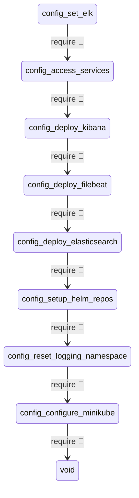

```mermaid
stateDiagram-v2
config_access_services --> config_deploy_kibana : require 🔵
config_deploy_kibana --> config_deploy_filebeat : require 🔵
config_deploy_filebeat --> config_deploy_elasticsearch : require 🔵
config_deploy_elasticsearch --> config_setup_helm_repos : require 🔵
config_setup_helm_repos --> config_reset_logging_namespace : require 🔵
config_reset_logging_namespace --> config_configure_minikube : require 🔵
config_configure_minikube --> void : require 🔴
config_set_elk --> config_access_services : require 🔵
```